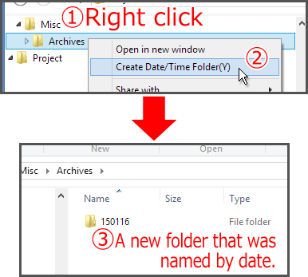
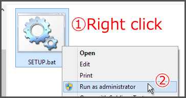

# ymdFolder

Add a command that creates a new folder that was named by date or time to the context menu of the Windows Explorer.

The name of new folder is fixed by the specific format and current date and time (year, month, day of month, hours, minutes and seconds).  
e.g. `2015-01-16`, `16-1-2015`, `23.59.59`, `15.01.16-23.59.59`, `16.1.2015 23.59` etc.

## Install/Uninstall
Right click a `SETUP.bat`, and select "Run as administrator".

## Customize Format
See the comment in a `ymdFolder.js`, and edit `FORMAT`.

## History
 * 2015-02-04           v0.2.0          Support some languages
 * 2015-01-16           v0.1.0          Initial release.
